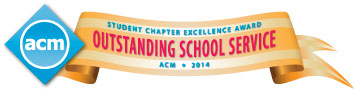

The Imperial College London ACM Student Chapter has won the 2013-2014
Student Chapter Excellence Award for Outstanding School Service!

This award recognises the work our students have put forth, and the
effort they made this year. We hope this is not the last award for the
Imperial College London ACM Student Chapter, rather a first out of many
awards to come in future years.

We hope this award can serve as an encouragement for students to
actively take part in our activities and be part of the bigger computing
research community at the Department that we thrive to create.

If you would like to become a member of the chapter and contribute to
our efforts, you can do so through our sign-up
[form](http://acm.doc.ic.ac.uk/). If you are already a member and would
like to have more say in the future of the chapter, stayed tuned as we
will be announcing information on 2014-2015 chapter officer elections
in the following weeks.
