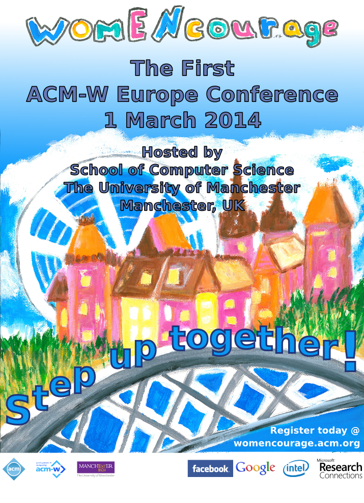

ACM-W Europe, the Association for Computing Machinery's Committee on
Women in Computing in Europe are sponsoring a conference specifically
for encouraging women to stay in the field. This conference will be held
in Manchester, UK, with the motto womENcourage. We encourage all
students to submit a poster and to apply for travel grants so that they
have the funds to travel to the conference.

### Opportunities for Students

* [Submit](http://womencourage.acm.org/poster.cfm) an abstract for the
  Student Poster session: We invite poster submissions of original work
  by students (female  and male) in all areas of computing and related
  disciplines. The deadline for submission is December 13th, 2013.

* [Apply](http://womencourage.acm.org/grants.cfm) for a Travel Grant
  A limited number of travel grants will be available to assist with 
  travel expenses to the conference. The deadline for submission is 
  December 13th, 2013.

We are looking forward to seeing you at
[womENcourage](http://cdt.bilkent.edu.tr/ACM_WomENcourage2014) on March
1, 2014.  Please feel free to [contact us](mailto:acm-w-europe@acm.org)
if you have questions or need more information.

