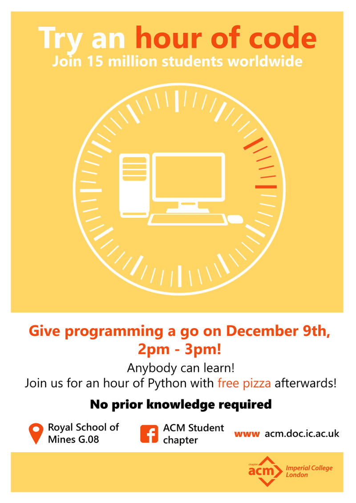

We are very glad to present the ACM Imperial Chapter Hour of Code 2015 event!
The Hour of Code is an international event organised by the mothership ACM to
promote Computer Science public education. Join several millions of students
coding simultaneously all over the planet! (Each one on a separate computer)

In the Hour of Code you will get the chance to try out some programming with
the help of expert, all-knowing computer science PhD students. We suggest you
to try a slick, powerful language called Python,that is used by many top-notch
companies like Youtube and Dropbox.  The tutorials will be adequate to any
level from code-phobic to  intermediate.  The duration of the event is, against
all odds, sixty minutes.

Also, the Hour of Code, or as we call it, the Moment of Joy, will be followed
by copious amounts of **free pizza!** This is so that you recover from the
rewarding mental and physical effort that is writing a computer program. The
rules for the obtainment of free pizza are simple: No Python, no pizza.
Python, pizza. Or, in Python:

```python
if you.going(HourOfCode):
   you.fill(pizza)
else:
   you.regret()
```
The event runs from 1400 to 1500.

<span class="more"></span>
<center>

</center>
