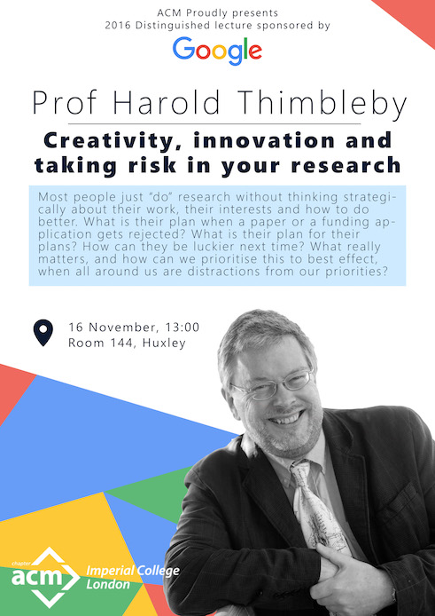

It's with great pleasure that the ACM Student Chapter hosted Professor Harold Thimbleby for a talk about Creativity, innovation and taking risk in your research.
Find more information about Prof Harold Thimbleby and his research here: [http://www.harold.thimbleby.net](http://www.harold.thimbleby.net)

