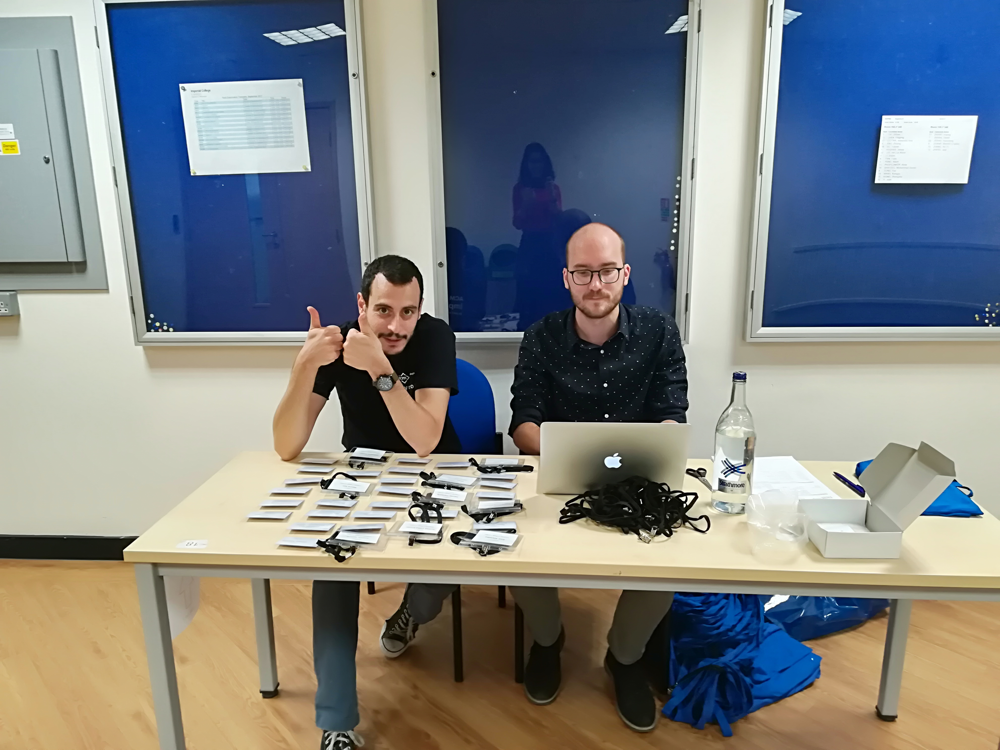
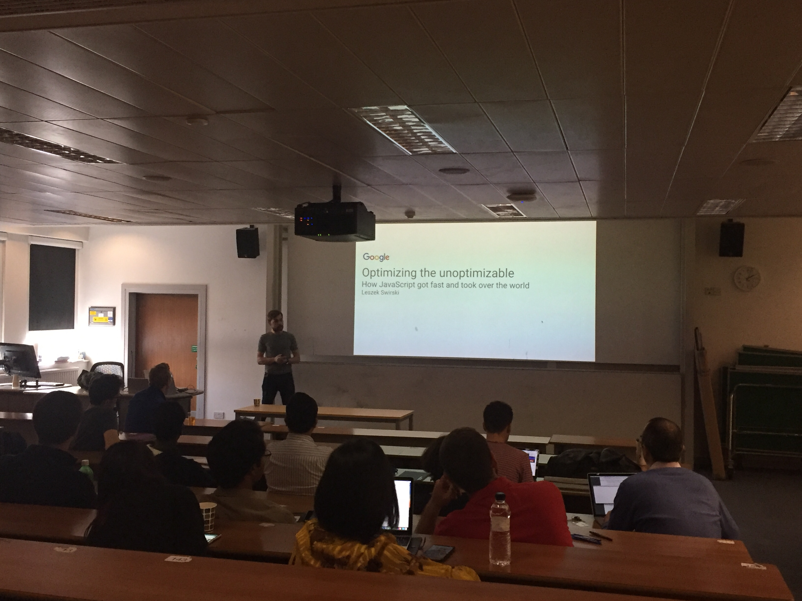

 &nbsp;

#### After a year hiatus, ICCSW was back!
###### 26th - 27th Sept.

It was a great success on all fronts, with over 30 students attending a variety of interesting and novel talks, covering systems, networking, programming languages and machine learning.
This year, aloneside with the student talks, keynotes _Google’s Javascript Engine_ from Leszek Swirski and _How to Write a Great Paper_ from Simon Peyton Jones, and social event in Sky Garden, we had a new addition of a breakfast poster session, where students arose first thing in the morning to be quizzed on their posters, as inquisitive wanderers chowed down on croissants and coffee.

 

<!-- -->

<!--
-->
<!-- &nbsp;-->
<!-- &nbsp;-->
<!-- &nbsp;-->
<!---->
<!--
-->

<!-- -->

<!--
-->
<!-- -->
<!--
-->

We hosted two exciting keynotes, _Google’s JavaScript Engine_ (Leszek Swirski) and _How to Write a Great Paper_ (Simon Peyton Jones), both of which saw many students and staff attend.
Leszek Swirski talked their recent work on optimisation of V8 JavaScript Engine.
By looking at the run-time state, they increase the performance of JavaScript codes.
Simon Peyton Jones talked several tips for writing a research paper.
All those tips are helpful for many junior and even senior researchers.

 &nbsp;
 

 

For our social event, we invited the students to explore the Sky Garden atop the Walkie Talkie and took them on a tour of the surrounding London sights, including the Tower of London and Tower Bridge, before settling down for dinner and dessert afterward.

 

 &nbsp;

 

We also thank for the dedication and perserverence from the ICCSW committee, hard work by the student authors, financial support from our sponsors, [Google](https://www.google.com/about/), [HiPEDS](http://wp.doc.ic.ac.uk/hipeds/), and the gratiutous support from [the department of computing, Imperial College London](http://www.imperial.ac.uk/computing).

We wish the best of luck to the new committee. Until next year!

Juliana & Fergus, 
Chair & Vice-Chair, 
ACM Student Chapter 2016-2017.
