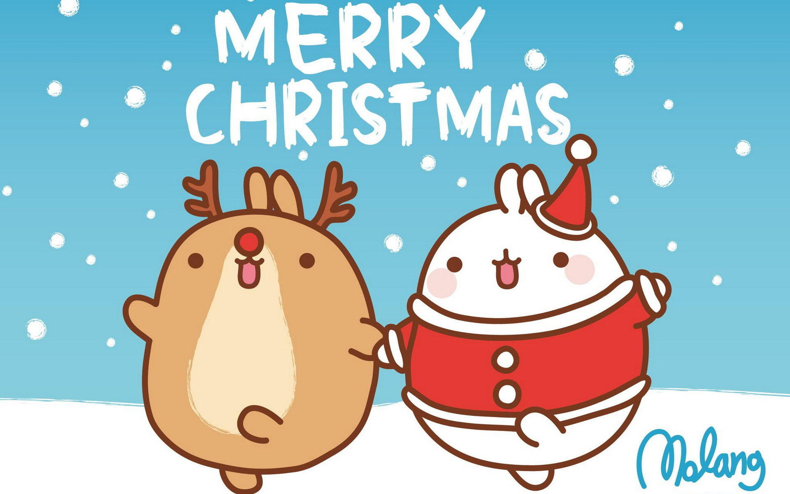

#### Merry Christmas!

We wish you a merry Christmas.
Hope all of you enjoying our [student workshop (ICCSW)](/workshops/), social events and seminars for 2017.

#### Here is another social event and possibly the last one for 2017 --- Christmas Dinner. 

We invited all PhD. Students and RAs for the dinner.
Thanks for everybody spending an evening with us ☺, as we all know the end of a term could be very busy.
Also we have [Tom Ellis](https://www.microsoft.com/en-us/research/people/toelli/) on behalf of our sponsor [Macrosoft](https://www.microsoft.com/en-gb/) and he gave us a short talk about the career as a research software engineer in [Microsoft Research Cambridge(MSR)](https://www.microsoft.com/en-us/research/lab/microsoft-research-cambridge/).
The research software engineers in [MSR](https://www.microsoft.com/en-us/research/lab/microsoft-research-cambridge/) first help researchers and second transfer research ideas into software prototypes and then products.
He also mentioned [MSR](https://www.microsoft.com/en-us/research/lab/microsoft-research-cambridge/) is always welcome Imperial College's students to do internship and apply job.

 

